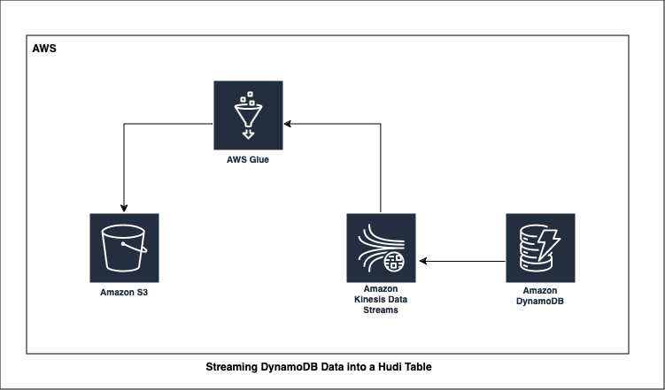

# AWS Glue, SAM, and DynamoDB Dummy Data Pipeline

## Overview

This repository demonstrates a pipeline using AWS Glue, DynamoDB, and Hudi, with infrastructure deployed via AWS SAM. Additionally, a Python script generates and inserts dummy data into DynamoDB.

 \
Architecture Diagram

## Directory Structure

```bash
├── aws-glue-job-script
│   ├── Readme.md
│   └── glue-job-script.py
├── aws-sam-template
│   ├── Readme.md
│   ├── samconfig.toml
│   └── template.yaml
└── dummy-data-script
    ├── Readme.md
    ├── ecom-dummy-data.py
    └── requirements.txt
```
